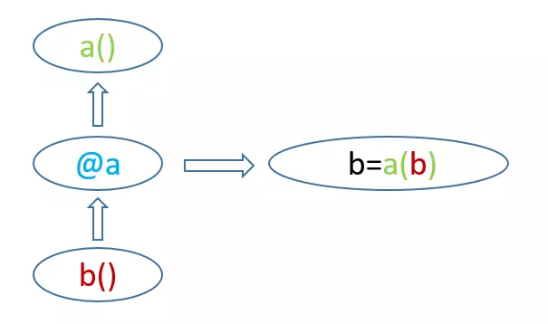

# Decorator

A decorator is a wrapper for a function. 

Input a `fin`, output the `fout`. \( `fout`is a decorated function\)



Example:

Example of the creation of the decorator.

```python
import functools
def memoize(fn):
    known = dict()
    
    @functools.wraps(fn)    
    #functiontools can keep the __name__ and __doc__ of the original function.
    def memoizer(*args):
        if args not in known:
        known[args] = fn(*args)
        return known[args]
        
return memoizer
```

Example of the usage of the decorator.

```python
@memoize    #syntactic sugar
def fibonacci(n):    # The finbonacci is replaced to the memoizer
    '''返回斐波那契数列的第n个数'''
    assert(n >= 0), 'n must be >= 0'
    return n if n in (0, 1) else fibonacci(n-1) + fibonacci(n-2)
```


